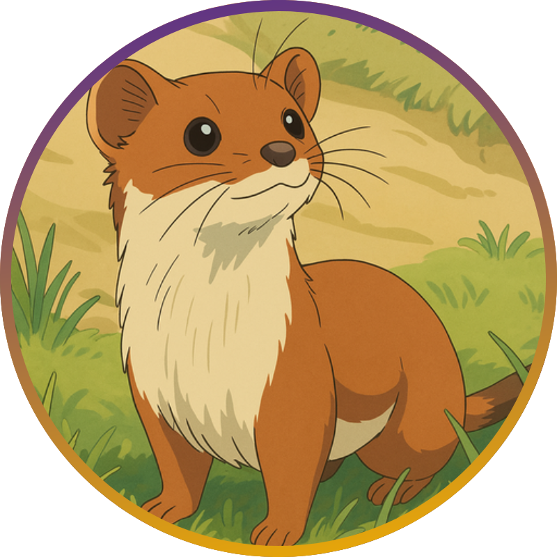

# CUHK-SToAT: Open Statistical Toolkits 

The **stoat** project is a comprehensive initiative designed to enhance the development of essential, foundational, and practical statistical toolkits. Its overarching aim is to widen the scope of operability and practicality intrinsic to statistical concepts and methodologies. The principles of the Stoat project can be underscored as follows:

- **Open**. stoat supports open-source, and all toolkits will be published in Github.
- **Decentralization**. stoat does not claim credits for every project or toolkit. Rather, all credits associated with a particular project are duly accorded to the respective developers and contributors.
- **Cooperation**. stoat involves active cooperation between developers/contributors and mentors. Most projects are initiated by mentors who propose preliminary ideas and aims. The project then is progressively proceeded through collaboration between contributors and mentors.
- **Paid-position**. stoat offers paid short-term academic positions offered by CUHK-STAT, such as student helper or research assistant (RA). In short, each contributor selected for a **stoat** project will get paid academic position to work on an Python/R package for 12 - 24 weeks.

## Table of Proposed Projects

| Date     | Proposal                                                     | Github | Status  | languages | Contributors                                 |
| -------- | ------------------------------------------------------------ | ------ | ------- | --------- | ------------------------------------------- | 
| 03/25 | [Empirical evaluation of Dice/IoU in Segmentation](./md/dice.md) |        | Hiring | Python    |                                             |
| 01/25 | [Matrix Factorization Optimization with various Loss functions](./md/mfL.md) |        | Ongoing | Python    | Xiaochen Su                                             |
| 01/25 | [Fast Path Solution for plqERM](./md/path_plqERM.md) |        | Ongoing | Python    |          Youtong Li                                   |
|          |                                                              |       |                                    |           |                                             |          

<!-- | 12/23 | [PLQ Composite Decomposition](./md/plq.md)                   |   [PLQComposite](https://github.com/keepwith/PLQComposite)     | Done | [Ben Dai](https://www.bendai.org/), [Yixuan Qiu](https://statr.me/about/) | Python | [Tingxian Gao](https://github.com/keepwith) | @CUHK    | -->

**We Support Your Proposal.** If you have clear objectives and strategies for a statistical toolkit, you are invited to upload your project proposal (see [Proposal template](https://github.com/stoat-proj/SToAT/wiki/Proposal-template)) in the [discussion](https://github.com/stoat-proj/SToAT/discussions/new?category=project-proposal) section under project proposal category. PIs will assess its feasibility and provide support accordingly.

## Table of Developed Projects

| Date     | Proposal                                                     | Outcome | languages | Contributors                                |
| -------- | ------------------------------------------------------------ | ------- | --------- | ------------------------------------------- |
| 12/23 | [PLQ Composite Decomposition](./md/plq.md)                   |   [Github](https://github.com/keepwith/PLQComposite) | Python | [Tingxian Gao](https://github.com/keepwith) |
| 03/24 | [Portfolio Optimization via ReHLine](./md/PO_ReHLine.md) (pre) |   [Github](https://github.com/softmin/ReHLine-PO)   |  Python    |  [Alibek Orazalin](https://github.com/aorazalin)                       | @CUHK    |
|          |                                                              |        |         |                                    |           |                                             |          |

## How to Participate

Student who wants to participate in SToAT project should:

- please review the [README](https://github.com/stoat-proj/SToAT) of the SToAT project to ensure that it aligns well with your expertise and interests;
- please check and follow the [SToAT-wiki: Participation workflow](https://github.com/stoat-proj/SToAT/wiki/Participation-workflow) which provides an in-depth explanation of the workflow for the SToAT project; also consider referring to [SToAT-wiki: application template](https://github.com/stoat-proj/SToAT/wiki/application-template);
- correspond with mentors via email to discuss the relevant project, if necessary.

## Acknowledge

**stoat** is initiated by several junior statistics PIs to contribute to the development of basic, fundamental and practical statistical toolkits. **stoat** is initially inspired by [Google Summer of Code](https://github.com/rstats-gsoc) initiative, and provides more flexible timeline, research-oriented projects, and offers paid university-based academic job positions.

**Support SToAT.** Stoat enthusiastically welcomes more co-PIs to join, providing opportunities for students interested in statistical software development, as well as contributing to the development and promotion of open-source statistical toolkits. The role of the PI is pivotal in overseeing the project, providing vision, direction, and coordinating the contributors' efforts. Please check [SToAT-wiki: Become a co-PI of SToAT](https://github.com/stoat-proj/SToAT/wiki/Become-a-PI-of-SToAT) for more information.

<!-- ## Sponsors -->

<!-- 
 -->
  <!--  -->
  <!--  -->
  <!--  -->
<!-- 
 -->

